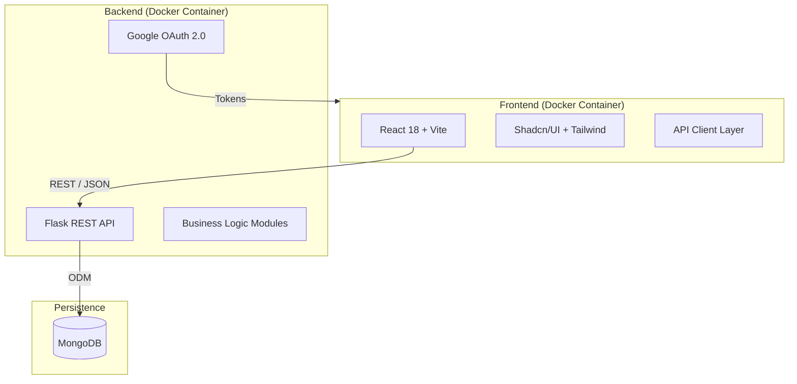

# Rooster 🐓

> **The "Enterprise-Grade" Solution for Student Chaos Management.**

[](https://react.dev/)
[](https://flask.palletsprojects.com/)
[](https://www.docker.com/)
[](https://www.mongodb.com/)
[](https://ui.shadcn.com/)

---

## 📋 Executive Summary
**Rooster** is a modern, full-stack educational management platform designed to replace fragmented tools (spreadsheets, sticky notes, and group chats) with a single, cohesive dashboard. Built with a "student-first" mindset but engineered with "enterprise-grade" reliability, it streamlines the entire academic lifecycle—from roster imports to final grade exports.

It features **Role-Based Access Control (RBAC)** for Instructors and Students, ensuring a secure and tailored experience for every user.

## ✨ Key Capabilities

### 🎓 Smart Roster Management
*   **Bulk Onboarding**: Drag-and-drop CSV imports to onboard hundreds of students in seconds (`server/routes/roster.py`).
*   **Seamless Enrollment**: innovative 6-character "Join Codes" allow students to self-enroll securely.
*   **Data Export**: One-click CSV export for external reporting.

### 📍 Data-Driven Attendance
*   **Secure Check-ins**: Generates ephemeral 4-digit codes for live sessions, preventing "buddy punching."
*   **Instant Reporting**: Real-time attendance rate calculation per student.
*   **History Tracking**: Full audit logs of every session.

### 📊 Full-Cycle Gradebook
*   **Assignment Management**: Create, edit, and track deliverables with due dates.
*   **Visual Feedback**: Students see their "standing" at a glance.
*   **Analytics**: Instructors get a bird's-eye view of class performance (averages, distributions).

### 📢 Unified Communication
*   **Announcements Feed**: pinned updates and rich-text announcements replace noisy group chats.
*   **Context-Aware**: Updates are scoped strictly to the relevant class.

### 🎨 Features You Can Feel
*   **Premium UX**: Fully responsive design powered by **Shadcn/UI** & **Tailwind CSS**.
*   **Theme Engine**: System-aware Dark/Light mode toggle.
*   **Skeleton Loading**: "App-like" feel with shimmer effects during data fetches.
*   **Command Palette**: `Ctrl+K` (or `Cmd+K`) accessible navigation for power users.
*   **Easter Egg**: A hidden "Feed the Rooster" console game for developers (Open DevTools!).

---

## 🏗 System Architecture

Rooster utilizes a decoupled, containerized architecture designed for scalability and ease of deployment.



*   **Frontend**: React 18, Vite, Radix Primitives (Shadcn), Lucide Icons.
*   **Backend**: Python 3.12, Flask, MongoEngine (ODM).
*   **Database**: MongoDB (NoSQL) for flexible schema evolution.
*   **Infrastructure**: Docker Compose orchestration with Nginx reverse proxying.

---

## 🚀 Quick Start (Zero Config)

The entire application is containerized. You do not need Python or Node.js installed on your host machine to run this.

### Prerequisites
*   **Docker Desktop** (Running)

### 1. Clone & Configure
```bash
git clone https://github.com/Astatide1337/Rooster.git
cd Rooster
cp .env.example .env
# (Optional) Add your Google OAuth credentials to .env for login to work
```

### 2. Launch
```bash
docker-compose up -d
```
> The app will be available at **http://localhost** (Frontend) and **http://localhost:5000** (API).

### 3. Demo Data
*   **Login**: Sign in with Google.
*   **Hydrate**: Keep your fresh class empty, or go to the **Roster** tab and import `server/roster_sample.csv` to instantly populate it with dummy data.
*   **Play**: Open the browser console (`F12`) to find the hidden game!

---

## 🛠 Developer Guide

### Directory Structure
*   `client/`: React Frontend.
    *   `src/components`: Reusable UI bricks (Buttons, Dialogs, Tables).
    *   `src/pages`: logical route views (`ClassDetail`, `Dashboard`).
*   `server/`: Python Backend.
    *   `routes/`: API endpoint groupings (`grades.py`, `attendance.py`).
    *   `models.py`: Database schemas.

### Local Development (No Docker)
If you prefer running on metal:
1.  **Client**: `cd client && npm install && npm run dev`
2.  **Server**: `cd server && pip install -r requirements.txt && python main.py`

---

> Built with ❤️ and way too much caffeine.
