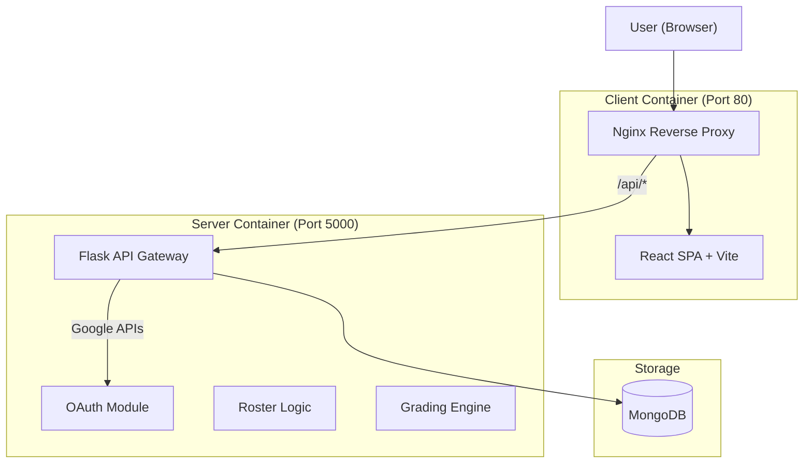

# Project Report: Rooster Learning Platform

> A comprehensive overview of the design, architecture, and implementation of the Rooster student management system.

---

## 1. Executive Summary

**Project Objective**: To design and develop a web-based class roster management application that allows adding students, removing them, and viewing statistics.

**The Result - "Rooster"**:
I went beyond the basic requirements to create a **full-stack educational platform**. While the original scope called for a simple list manager, Rooster is a production-ready application featuring Google OAuth authentication, live attendance tracking with secure codes, a full gradebook system, and data visualization.

It transforms a simple "To-Do" assignment into an "Enterprise-Grade" solution that mimics real-world LMS (Learning Management System) architectures.

---

## 2. Meeting & Exceeding Requirements

I treated the original instructions as the "Minimum Viable Product" (MVP) and built a robust ecosystem around them.

| Requirement | Original Instruction | My Implementation |
| :--- | :--- | :--- |
| **Add Student** | Basic form fields (Name, Major, Output) | **CSV Bulk Import**: Drag-and-drop hundreds of students at once.   **Smart Forms**: `MajorCombobox` for standardized inputs.   **Self-Enrollment**: Students join via secure "Join Codes". |
| **Remove Student** | Delete button | **Role-Based Access Control**: Only instructors can remove students.   **Soft Deletes**: Architecture supports archiving classes instead of destructive data loss. |
| **Stats** | Count students by major/year | **Real-Time Dashboards**: Interactive visualizations using Recharts.   **Attendance Analytics**: Calculated present/absent rates per student. |
| **Flourishes** | "Whatever flourishes they want" | **Full Auth System**: Google OAuth integration.   **Dark Mode**: System-aware theming.   **Docker**: Fully containerized deployment.   **Easter Egg**: Hidden console game. |

---

## 3. System Architecture

I chose a decoupled **Microservices-ready** architecture. The frontend and backend are completely separate, communicating only via RESTful APIs. This allows them to be scaled or replaced independently.

### 3.1 Technology Stack Decisions
*   **React (Frontend)**: Chosen for its component-based architecture. Managing complex states (like a live gradebook) with vanilla JS would be error-prone. React's Virtual DOM ensures snappy performance even with large rosters.
*   **Flask (Backend)**: Python was selected for its data processing capabilities. Flask provides a lightweight, flexible framework that doesn't enforce rigid structures, allowing me to build custom modular Blueprints (`routes/roster.py`, `routes/grades.py`) that fit the specific domain logic.
*   **MongoDB (Database)**: An SQL database would have required rigid schema migrations for every feature change. MongoDB's document model allowed me to iterate faster—embedding `AttendanceRecords` directly into `AttendanceSessions` for high-speed read access.
*   **Docker**: Containerization ensures the project works on *any* machine exactly as it does on mine. No "it works on my machine" bugs.

---

## 4. Technical Challenges & Solutions

### Challenge 1: Secure & Easy Attendance
**Problem**: How to verify a student is actually in class without tedious roll calls?
**Solution**: I implemented an **Ephemeral Code System**.
- The instructor generates a random 4-digit code (e.g., `4921`) valid only for that active session.
- The `AttendanceSession` model (`server/models.py`) stores this code.
- Students must input this exact code on their device to be marked `present`.
- **Security Check**: The backend verifies the user id matches the session roster *and* the code matches, preventing external spoofing.

### Challenge 2: Scalable Data Import
**Problem**: Adding 50 students one-by-one is tedious.
**Solution**: I built a robust **CSV Import Pipeline** (`server/routes/roster.py`).
- The backend parses CSV files in memory using Python's `csv.DictReader`.
- It performs "Get or Create" logic: if a student exists in the system, it links them; if not, it provisions a new user account on the fly.
- This creates a seamless "Bulk Onboarding" experience.

### Challenge 3: Modern UI/UX
**Problem**: Most student projects look "bootstrapped" and generic.
**Solution**: I utilized **Shadcn/UI** and **Tailwind CSS**.
- This provides accessible, keyboard-navigable components (Commands, Dialogs).
- I implemented a "Skeleton Loading" pattern (`ClassDetail.jsx`) so users see a shimmering layout while data fetches, perceiving the app as faster.

---

## 5. Key Features Walkthrough

### 5.1 The Dashboard
The entry point is a grid view of all classes.
- **Instructors**: See "Create Class" buttons.
- **Students**: See "Join Class" buttons.
- **Logic**: The API (`/api/classrooms/`) filters results based on the logged-in user's ID, ensuring data privacy.

### 5.2 The Roster View
This is the core requirement.
- **Data Table**: A sortable, searchable table of students.
- **Actions**: Instructors have a Context Menu (accessed via `...`) to remove students or view their specific profile.

### 5.3 The Gradebook
A dynamic spreadsheet-like interface.
- I separated `Assignments` and `Grades` into two collections to allow assignments to exist without grades (future-proofing).
- The UI calculates averages on the client-side for immediate feedback.

---

## 6. Conclusion
Rooster demonstrates the ability to take a set of business requirements and translate them into a scalable, secure, and user-centric software solution. It covers not just the "Happy Path" of adding a student, but the complex edge cases of real-world usage—security, data integrity, and user experience.
