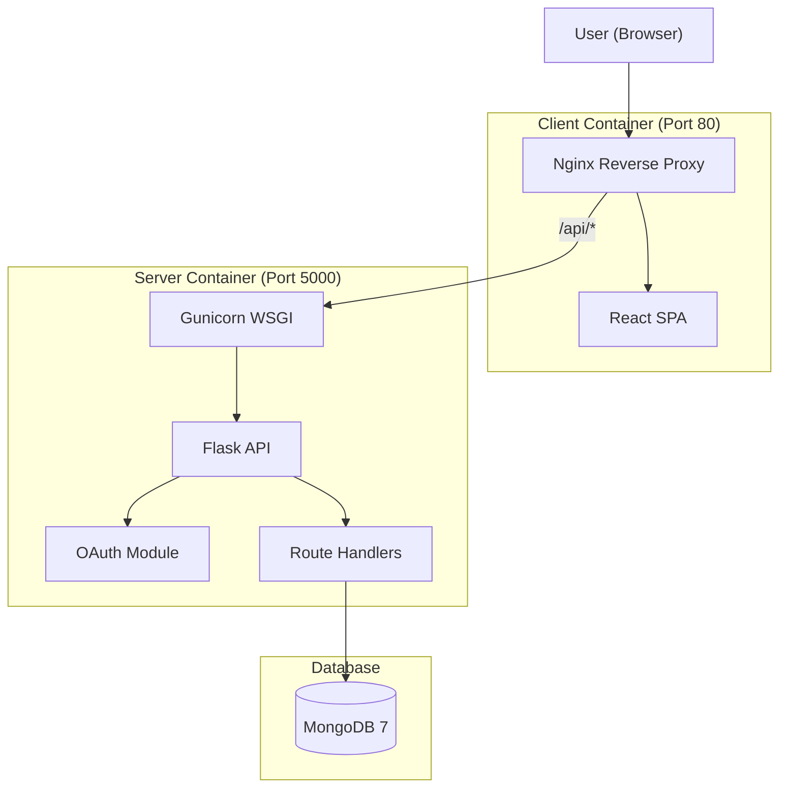

# Rooster Technical Overview

A technical walkthrough of the Rooster classroom management platform, covering architecture decisions, key features, and implementation details.

---

## System Architecture

Rooster uses a decoupled client-server architecture. The frontend and backend are separate applications that communicate via RESTful APIs, enabling independent scaling and deployment.

### Technology Choices

| Layer | Technology | Rationale |
|-------|------------|-----------|
| Frontend | React 19 | Component-based architecture for complex state management (gradebook, attendance). |
| UI Library | Shadcn/UI | Accessible, keyboard-navigable components with Radix primitives. |
| Styling | Tailwind CSS | Utility-first approach for consistent, maintainable styles. |
| Backend | Flask | Lightweight framework allowing modular Blueprint organization. |
| WSGI Server | Gunicorn | Production-grade server with worker process management. |
| Database | MongoDB | Document model supports flexible schema evolution without migrations. |
| ODM | MongoEngine | Python ODM providing schema validation and query building. |
| Container | Docker | Ensures consistent deployment across environments. |

---

## Data Models

### User
Stores authenticated users with Google OAuth integration.

| Field | Type | Description |
|-------|------|-------------|
| email | EmailField | Unique email address |
| google_id | StringField | Google OAuth identifier |
| name | StringField | Display name |
| picture | StringField | Profile picture URL |
| role | StringField | Primary role (student/instructor/admin) |
| student_id | StringField | Optional student identifier |
| major | StringField | Optional major/department |
| grad_year | IntField | Optional graduation year |

### Classroom
Represents a class section with instructor and enrolled students.

| Field | Type | Description |
|-------|------|-------------|
| name | StringField | Class name |
| term | StringField | Academic term (e.g., "Fall 2026") |
| section | StringField | Optional section identifier |
| instructor | ReferenceField | Instructor user reference |
| students | ListField | Enrolled student references |
| join_code | StringField | Unique 6-character enrollment code |
| status | StringField | Active or inactive |
| created_at | DateTimeField | Creation timestamp |

### Assignment
Represents a gradable assignment within a classroom.

| Field | Type | Description |
|-------|------|-------------|
| classroom | ReferenceField | Parent classroom |
| title | StringField | Assignment title |
| description | StringField | Optional description |
| points_possible | FloatField | Maximum points |
| due_date | DateTimeField | Optional due date |

### Grade
Stores individual student grades for assignments.

| Field | Type | Description |
|-------|------|-------------|
| assignment | ReferenceField | Parent assignment |
| student | ReferenceField | Student user |
| score | FloatField | Points earned |
| feedback | StringField | Instructor feedback |

### AttendanceSession
Represents an attendance-taking session with check-in records.

| Field | Type | Description |
|-------|------|-------------|
| classroom | ReferenceField | Parent classroom |
| date | DateTimeField | Session date |
| code | StringField | 4-digit check-in code |
| is_open | BooleanField | Whether check-in is active |
| records | ListField | Embedded attendance records |

### Announcement
Class announcements from instructors to students.

| Field | Type | Description |
|-------|------|-------------|
| classroom | ReferenceField | Parent classroom |
| author | ReferenceField | Instructor who created it |
| title | StringField | Announcement title |
| content | StringField | Announcement body |
| created_at | DateTimeField | Creation timestamp |
| updated_at | DateTimeField | Last modification timestamp |

---

## Key Features

### Authentication Flow

1. User clicks "Sign In" on the landing page
2. Frontend redirects to `/auth` which initiates Google OAuth
3. Google redirects back with authorization code
4. Backend exchanges code for tokens and retrieves user info
5. User document is created or updated in MongoDB
6. Session cookie is set for subsequent requests
7. New users are directed to profile setup

### Attendance System

The attendance system uses ephemeral 4-digit codes for verification:

1. Instructor starts an attendance session
2. System generates a random 4-digit code
3. Instructor displays the code to the class
4. Students enter the code on their devices
5. Backend verifies:
   - Student is enrolled in the class
   - Session is open
   - Code matches
6. Attendance record is created with timestamp
7. Instructor can manually mark students if needed
8. Session can be closed to prevent late check-ins

### CSV Import/Export

The roster import uses a pipeline approach:

1. Frontend sends CSV file via multipart form
2. Backend parses with `csv.DictReader`
3. For each row:
   - Check if user exists by email
   - Create new user if needed (generates placeholder Google ID)
   - Add user to classroom roster if not already enrolled
4. Return summary of imported/skipped records

Export operations sanitize data to prevent CSV injection by prefixing cells starting with `=`, `+`, `-`, or `@` with a single quote.

### Role-Based Access Control

Access control is enforced at the route level:

| Resource | Instructor | Student |
|----------|------------|---------|
| Create class | Yes | No |
| Delete class | Yes | No |
| Add/remove students | Yes | No |
| Create assignment | Yes | No |
| Grade assignments | Yes | No |
| View own grades | N/A | Yes |
| Start attendance | Yes | No |
| Check in to attendance | No | Yes |
| Post announcements | Yes | No |
| View announcements | Yes | Yes |

---

## Frontend Architecture

### Page Components

| Component | Purpose |
|-----------|---------|
| `Home.jsx` | Landing page with animated demos |
| `Dashboard.jsx` | Class grid with create/join functionality |
| `ClassDetail.jsx` | Tabbed interface for class management |
| `ProfileSetup.jsx` | First-time user profile configuration |
| `AuthCallback.jsx` | OAuth redirect handler |

### State Management

The application uses React's built-in state management:

- `useState` for local component state
- `useEffect` for data fetching and side effects
- `useCallback` for memoized handlers
- Context API for global state (user, theme, actions)

### UI Patterns

- **Skeleton Loading:** Shimmer placeholders during data fetches
- **Toast Notifications:** Sonner library for user feedback
- **Command Palette:** Global navigation with `Ctrl+K`
- **Responsive Design:** Mobile-first with Tailwind breakpoints

---

## Backend Architecture

### Route Organization

Routes are organized into Flask Blueprints:

| Blueprint | Prefix | Purpose |
|-----------|--------|---------|
| `api_bp` | `/api` | User info endpoints |
| `classrooms_bp` | `/api/classrooms` | Classroom CRUD |
| `roster_bp` | `/api/roster` | Roster and attendance |
| `grades_bp` | `/api/grades` | Assignments and grading |
| `announcements_bp` | `/api/announcements` | Announcement CRUD |
| `auth_bp` | (none) | OAuth flow handlers |

### Error Handling

Global error handlers provide consistent error responses:

- **MongoValidationError:** Returns 400 with user-friendly message
- **Generic Exception:** Logs full error, returns 500 with generic message

### Health Checks

Production health endpoints for container orchestration:

- `/health`: Liveness probe (always returns 200 if app is running)
- `/ready`: Readiness probe (verifies database connectivity)

---

## Deployment

### Docker Compose Services

| Service | Image | Purpose |
|---------|-------|---------|
| `server` | Custom (Python 3.12) | Flask API with Gunicorn |
| `client` | Custom (Node + Nginx) | React SPA served by Nginx |
| `mongo` | mongo:7 | MongoDB database |

### Production Configuration

- Gunicorn with auto-scaling workers: `(2 × CPU cores) + 1`
- Nginx for static file serving and reverse proxy
- Docker health checks for service orchestration
- Environment variables for all secrets (never in code)

---

## Security Considerations

1. **Session Security:** HTTPOnly, Secure, SameSite cookies
2. **CORS:** Restricted to configured frontend URL
3. **Secret Key:** Enforced in production, fails fast if missing
4. **CSV Injection:** Output sanitization for exported files
5. **Input Validation:** MongoEngine schema validation
6. **Error Masking:** Generic messages in production, detailed logs for debugging
