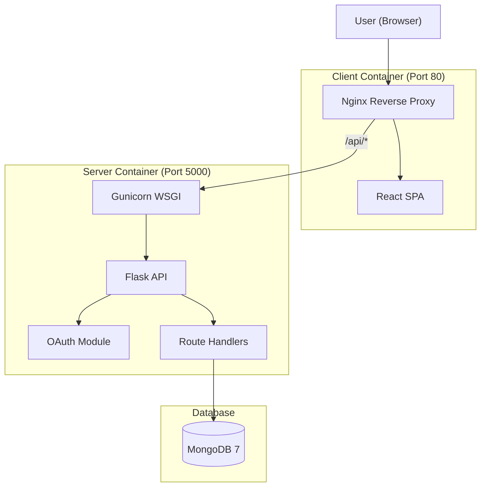

# Rooster Technical Overview

A technical walkthrough of the Rooster classroom management platform, covering architecture decisions, key features, and implementation details.

---

## System Architecture

Rooster uses a decoupled client-server architecture. The frontend and backend are separate applications that communicate via RESTful APIs, enabling independent scaling and deployment.

### Technology Choices

| Layer | Technology | Rationale |
|-------|------------|-----------|
| Frontend | React 19 | Component-based architecture for complex state management. |
| UI Library | Shadcn/UI | Accessible, keyboard-navigable components with Radix primitives. |
| Styling | Tailwind CSS | Utility-first approach for consistent, maintainable styles. |
| Backend | Flask | Lightweight framework allowing modular Blueprint organization. |
| WSGI Server | Gunicorn | Production-grade server with worker process management. |
| Database | MongoDB | Document model supports flexible schema evolution. |
| ODM | MongoEngine | Python ODM providing schema validation and query building. |
| Container | Docker | Ensures consistent deployment across environments. |

---

## Data Models

### User
| Field | Type | Description |
|-------|------|-------------|
| email | EmailField | Unique email address |
| google_id | StringField | Google OAuth identifier |
| name | StringField | Display name |
| picture | StringField | Profile picture URL |
| role | StringField | Primary role (student/instructor) |
| student_id | StringField | Optional student identifier |
| major | StringField | Optional major/department |
| grad_year | IntField | Optional graduation year |

### Classroom
| Field | Type | Description |
|-------|------|-------------|
| name | StringField | Class name |
| term | StringField | Academic term |
| section | StringField | Optional section identifier |
| instructor | ReferenceField | Instructor user reference |
| students | ListField | Enrolled student references |
| join_code | StringField | Unique 6-character enrollment code |
| status | StringField | Active or inactive (soft delete) |

### Assignment & Grade
| Field | Type | Description |
|-------|------|-------------|
| classroom | ReferenceField | Parent classroom |
| title | StringField | Assignment title |
| points_possible | FloatField | Maximum points |
| due_date | DateTimeField | Optional due date |
| score | FloatField | Points earned (Grade) |
| feedback | StringField | Instructor feedback (Grade) |

### AttendanceSession
| Field | Type | Description |
|-------|------|-------------|
| classroom | ReferenceField | Parent classroom |
| date | DateTimeField | Session date |
| code | StringField | 4-digit check-in code |
| is_open | BooleanField | Whether check-in is active |
| records | ListField | Embedded attendance records |

### Announcement
| Field | Type | Description |
|-------|------|-------------|
| classroom | ReferenceField | Parent classroom |
| author | ReferenceField | Instructor who created it |
| title | StringField | Announcement title |
| content | StringField | Announcement body |
| created_at | DateTimeField | Creation timestamp |

---

## Key Features

### Authentication (Google OAuth 2.0)
1. User clicks "Sign In" on the landing page
2. Frontend redirects to `/auth` which initiates Google OAuth with CSRF state
3. Google redirects back with authorization code
4. Backend exchanges code for tokens and retrieves user info
5. User document is created or updated in MongoDB
6. Session cookie is set (HTTPOnly, Secure, SameSite)
7. New users are directed to profile setup

### Attendance System
1. Instructor starts an attendance session
2. System generates a random 4-digit code
3. Students enter the code on their devices
4. Backend verifies enrollment, session status, and code match
5. Attendance record is created with timestamp
6. Instructor can manually mark students (present/absent/late/excused)
7. Session can be closed to prevent late check-ins
8. Export to CSV with sanitized data

### Grades & Assignments
- Create assignments with title, description, points, and due date
- Enter grades with optional feedback
- Students see only their own grades
- Instructors see all grades with class average
- Export grades to CSV with per-assignment columns

### Class Statistics (Instructor Only)
- Total student count
- Major distribution breakdown
- Graduation year distribution
- Overall attendance rate percentage
- Class average grade percentage

### CSV Import/Export
- Import roster via CSV upload (creates users if needed)
- Export roster, attendance, and grades
- CSV injection prevention (formula sanitization)

### Announcements
- Create/edit/delete announcements
- Displayed newest-first with author info
- Timestamps for created and updated

---

## Frontend Architecture

### Page Components
| Component | Purpose |
|-----------|---------|
| `Home.jsx` | Landing page with animated demos |
| `Dashboard.jsx` | Class grid with create/join functionality |
| `ClassDetail.jsx` | Tabbed interface for class management |
| `ProfileSetup.jsx` | First-time user profile configuration |

### UI/UX Features
- **Dark/Light Theme Toggle:** System preference detection with manual override
- **Command Palette (Ctrl+K):** Global navigation with context-aware actions
- **Skeleton Loading:** High-fidelity shimmer placeholders
- **Toast Notifications:** Sonner library for user feedback
- **Error Boundary:** Graceful fallback UI for React errors
- **Major Combobox:** Autocomplete with predefined options
- **Responsive Design:** Mobile-first with Tailwind breakpoints

### Landing Page
- Interactive demo carousel (desktop)
- Bento grid feature showcase (mobile)
- Scroll-driven feature animations
- Animated puppet cursor demos
- 3D card hover effects
- Text generate effect typography

---

## Backend Architecture

### Route Organization (Flask Blueprints)
| Blueprint | Prefix | Purpose |
|-----------|--------|---------|
| `api_bp` | `/api` | User info, logout |
| `classrooms_bp` | `/api/classrooms` | Classroom CRUD, statistics |
| `roster_bp` | `/api/roster` | Roster, attendance, import/export |
| `grades_bp` | `/api/grades` | Assignments, grading, export |
| `announcements_bp` | `/api/announcements` | Announcement CRUD |
| `auth_bp` | `/auth` | OAuth flow handlers |

### Health Checks
- `/health`: Liveness probe (app running)
- `/ready`: Readiness probe (database connectivity)

### Role-Based Access Control
| Resource | Instructor | Student |
|----------|------------|---------|
| Create/delete class | Yes | No |
| Manage roster | Yes | No |
| Create assignments | Yes | No |
| Grade assignments | Yes | No |
| View own grades | N/A | Yes |
| Start attendance | Yes | No |
| Check in | No | Yes |
| Post announcements | Yes | No |

---

## Deployment

### Docker Compose Services
| Service | Image | Purpose |
|---------|-------|---------|
| `server` | Python 3.12 + Gunicorn | Flask API |
| `client` | Node + Nginx | React SPA |
| `mongo` | mongo:7 | MongoDB database |

### Production Configuration
- Gunicorn with auto-scaling workers: `(2 × CPU cores) + 1`
- Nginx for static files and reverse proxy
- Docker health checks for orchestration
- Environment variables for all secrets

---

## Security

1. **Session Security:** HTTPOnly, Secure, SameSite cookies
2. **OAuth State Verification:** CSRF protection for login flow
3. **CORS:** Restricted to configured frontend URL
4. **Secret Key Enforcement:** Fails fast if missing in production
5. **CSV Injection Prevention:** Output sanitization
6. **Input Validation:** MongoEngine schema validation
7. **Role-Based Access:** Route-level permission checks

---

## Easter Egg

Open the browser DevTools console and type `rooster.help()` to discover a hidden game!

Commands:
- `rooster.feed()` - Feed your bird to grow it
- `rooster.status()` - Check growth progress
- `rooster.fact()` - Random rooster trivia

Evolution: Egg → Chick → Rooster → Legend
